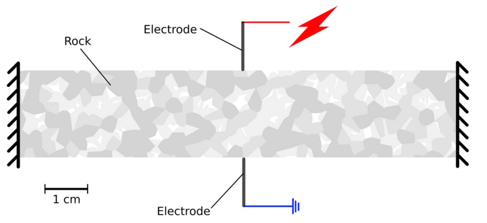
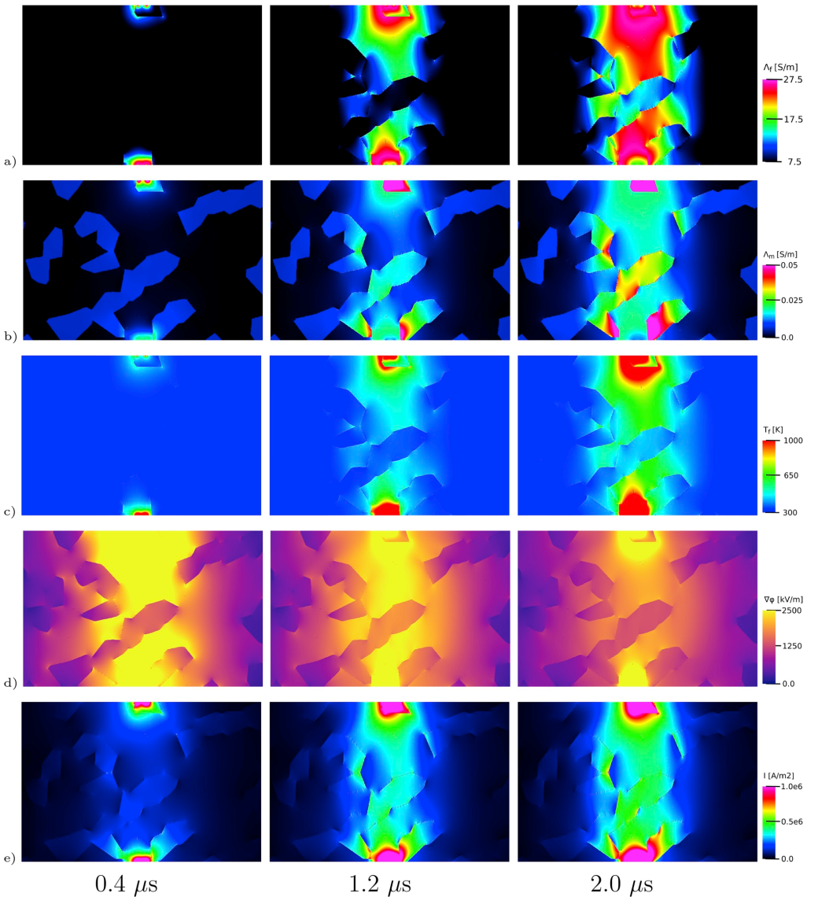

# electropulse_stimulation_modeling
Modeling of electropulse induced damage

### Files
- electric_potential: input files for [MOOSE simulator](www.github.com/idaholab/moose)
- input_files: input image used to construct material
- scripts: scripts to compute input variables and process simulation output

### Publications
- Walsh, S.D.C., and D. Vogler, Simulating Electropulse Fracture of Granitic Rock, International Journal of Rock Mechanics and Mining Sciences, 128, pp. 104238, 2020. [https://doi.org/10.1016/j.ijrmms.2020.104238](https://doi.org/10.1016/j.ijrmms.2020.104238)
- Vogler, D., S.D.C. Walsh, and M.O. Saar, A Numerical Investigation into Key Factors Controlling Hard Rock Excavation via Electropulse Stimulation, Journal of Rock Mechanics and Geotechnical Engineering, 12/4, pp. 793-801, 2020. [https://doi.org/10.1016/j.jrmge.2020.02.002](https://doi.org/10.1016/j.jrmge.2020.02.002)  

Electropulse stimulation system  

Time series for 0.4, 1.2 and 2.0~$\mu s$ for: a) Electrical conductivity of the fluid $\lambda_f$; b) Electrical conductivity of the material mix $\lambda_m$; c) Temperature of the fluid $T_{f}$; d) Electric Field $|\phi_{,j}|$; and e) Electric current $J_i$.
